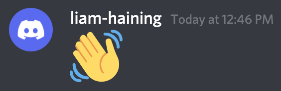
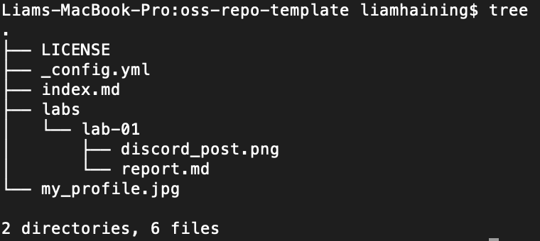
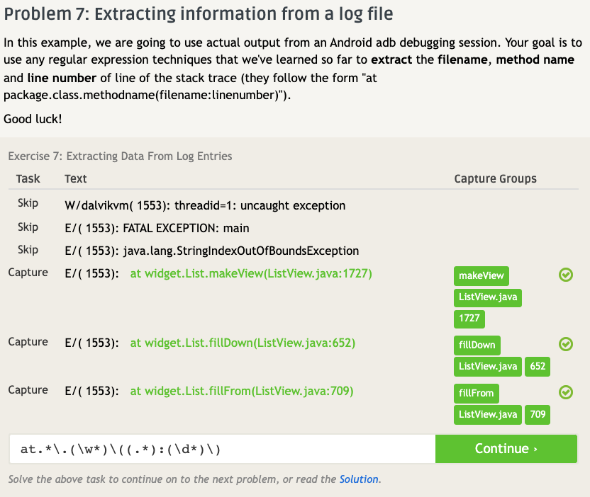
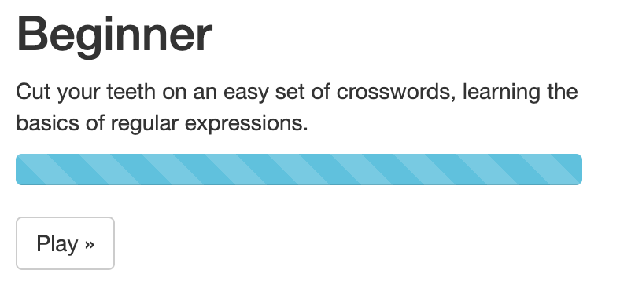
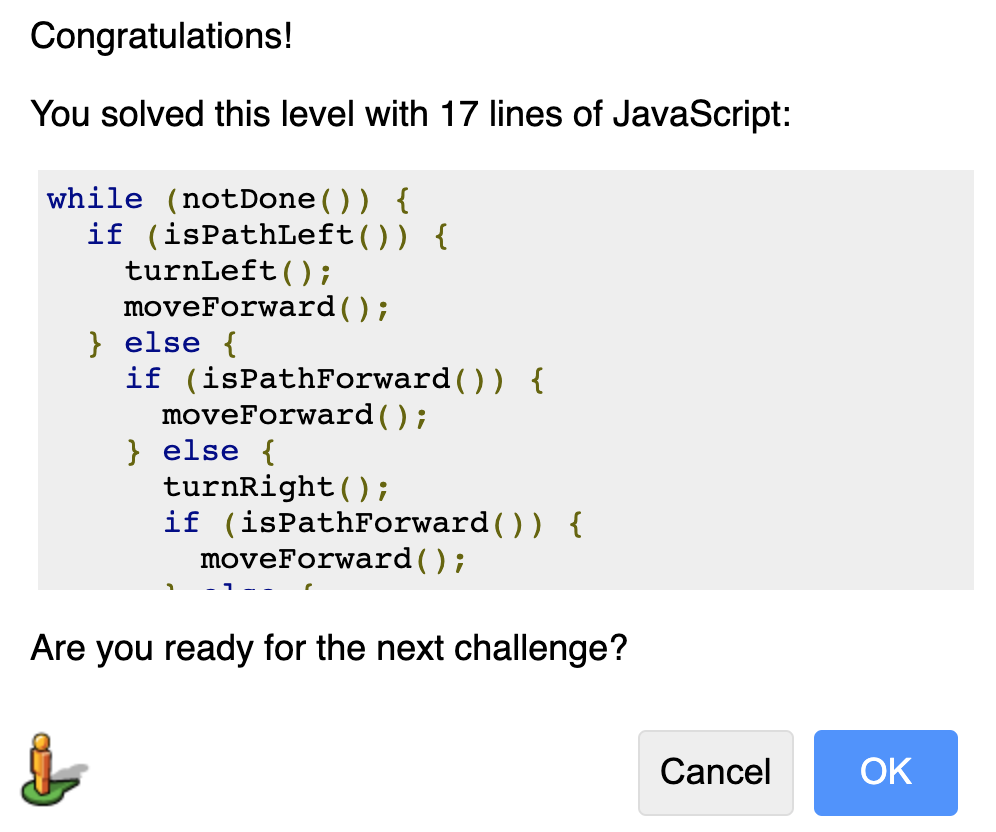

# Lab 01 Report - Introduction to Open Source Software
# Section 1 - Join the discord

# Section 2 - Reading
**Smart Questions**  
I found the reading How to Ask Questions the Smart Way interesting as it is applicable to me. I can acknowledge that in the past I have been quick to ask questions without fully understanding or properly researching what I am inquiring about.
On co-op, I found the best solutions to getting questions answered was with the following steps.
 1. Read source code and documentation, if question is company specific. Otherwise, google.
 2. Do my own testing and debugging locally to try and learn more in a hands-on manner.
	- A lot of times this would involve inspecting unit tests which often provided insight into the source code.
 3. Pose my question to my small-team group channel.
	- This usually solves it or gets me the name of a person who can answer my question.
 4. Post my question to the full developers channel.

**Free Culture**  
Freshman year, I recall attending a lecture on RPI's piracy policy which cited this particular incident. I remember the shock factor of hearing the final charges cited against Jesse. Corporations have a right to protect their copyrighted information but this is a perfect example of corporations abusing that right. Jesse adapted search engines that were already written and available to provide others with a more capable search engine. He simply crafted an engine capable of providing information that was already available in a more efficient way. While it provided users with copyrighted files, it did not pirate the files itself. The RIAA should not have been targeting Jesse for exposing the pirated files, they should have been targeting the owner of the files.

# Section 3 - Linux

# Section 4 - Regex
Solved all problems up through problem 7, here is a screenshot of my problem 7 solution:

Unsure what to screenshot but here is the full progress bar for the beginner section:

# Section 5 - Snap/Blockly
Completed the blockly puzzle by moving left whenever possible. If nothing to the left, move forward or turn right until you can move forwards.

# Section 6 - Reflection

