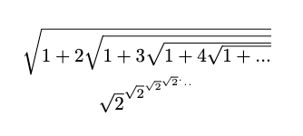
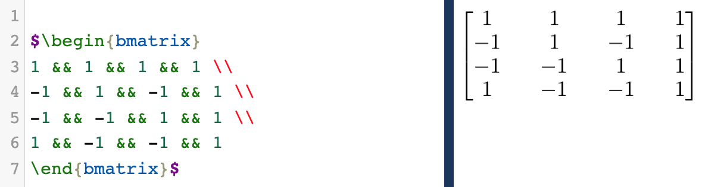
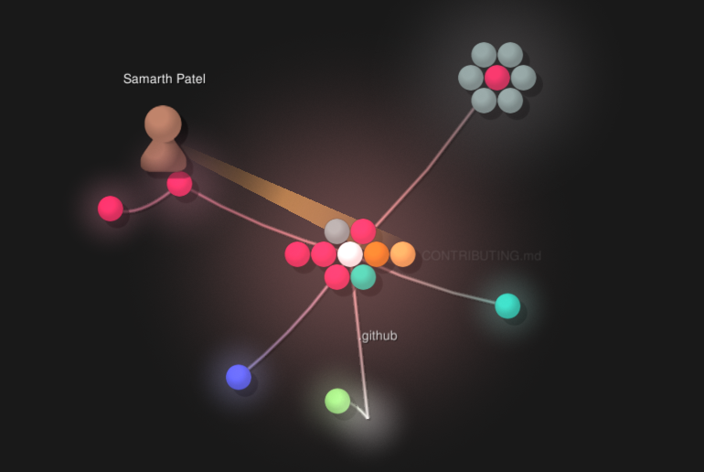

# Part 1
## Link to wiki
https://github.com/lhain08/oss-repo-template/wiki/Project-Proposal

## Latex

# Part 2
## Organizer - https://github.com/V2grad/Organizer
Contributors - 31
Lines of Code - 42912
Initial Commit - Tue Sep 11 11:15:24 2018
Latest Commit - Mon Oct 26 23:43:19 2020
Branches:
  origin/HEAD -> origin/master
  origin/master
  origin/web

## 990 - https://github.com/bparslow/990
Contributors - 1
Lines of code - 52372
Initial Commit - Sep 22, 2020
Latest Commit - Nov 15, 2020
Current branches:
  master

## Virtual Tab - https://github.com/marinater/virtual-tab
Contributors - 2
Lines of code - 3799
Initial Commit - Tue Mar 23 12:24:48 2021
Latest Commit - Sun May 2 23:59:27 2021
Current branches - 
  origin/HEAD -> origin/main
  origin/add-code-of-conduct-1
  origin/add-pyautogui-dep
  origin/contributing-update
  origin/debug-ui
  origin/dependency-licenses
  origin/main
  origin/mouse-control
  origin/save-and-load-default-params
  origin/style-guide
  origin/tracking-abstraction

## 3rs - https://github.com/jeffreyceballos/3rs
Contributors - 3
Lines of Code - 1948
Initial Commit - Feb 1, 2018
Latest Commit - May 3, 2018
Current branches:
  master
  new
  Kinza
  Paul

## Gitstats
Gitstats picked up on a few things that somehow were not visible via the command line. For example, it detected an additional contributor that did not appear for me when reading the list of contributors.
This was an interesting tool for analyzing the lifespan of a project and I am interested to use it on some projects of my own.

## Gource
Here is a screenshot from virtual tab's gource video:

