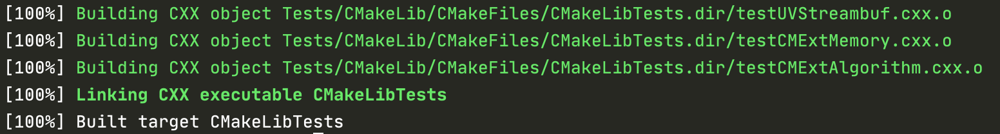
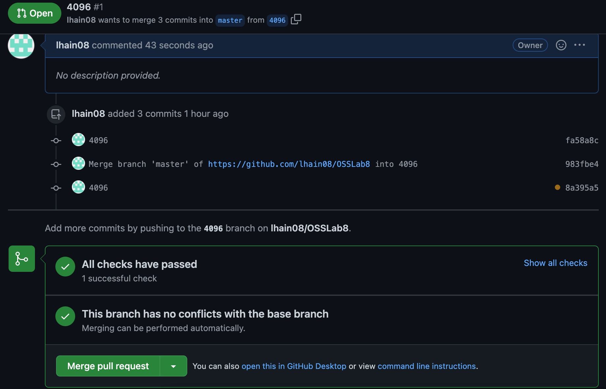

# Lab 8

## Checkpoint 1 - Getting Started

## Checkpoint 2 - Executing the tests

### How can you see what tests were run for a particular submission?

* You can click on the number of passed/failed tests to see the status of those tests

### Find a submission with errors. Can you see what the error condition was? How does this help you debug the failure?

* Yes, you can click on the number of failed tests to see the details of the test. Clicking on the individual failed tests you can see the test output which can help you solve why this test is failing.

### How clean is the dashboard? Are there any errors that you need to be concerned with?

* The dashboard for nightly builds is fairly clean. It could be a little more intuitive but everything you need to see is there.

### After Running the tests

## Checkpoint 3 - Failing/Passing a Test

This error, as the message shows was due to the copyright date being 2000-2020 rather than up to date as 2000-2022. Fixing this allowed the tests to pass.

## Checkpoint 4 - CI/CD

Link to repository: https://github.com/lhain08/OSSLab8

