# Lab Databases

## Checkpoint 1

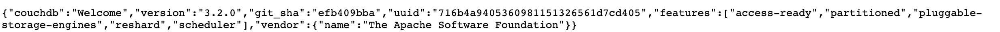

## Checkpoint 2

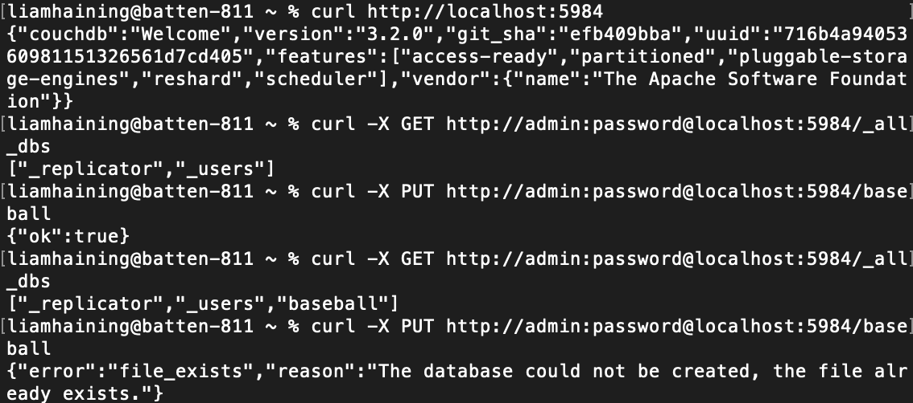

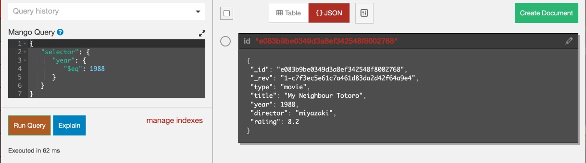

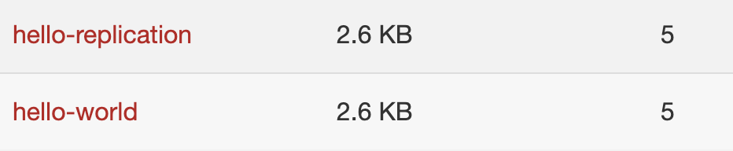

## Checkpoint 3

Generating verbose output:

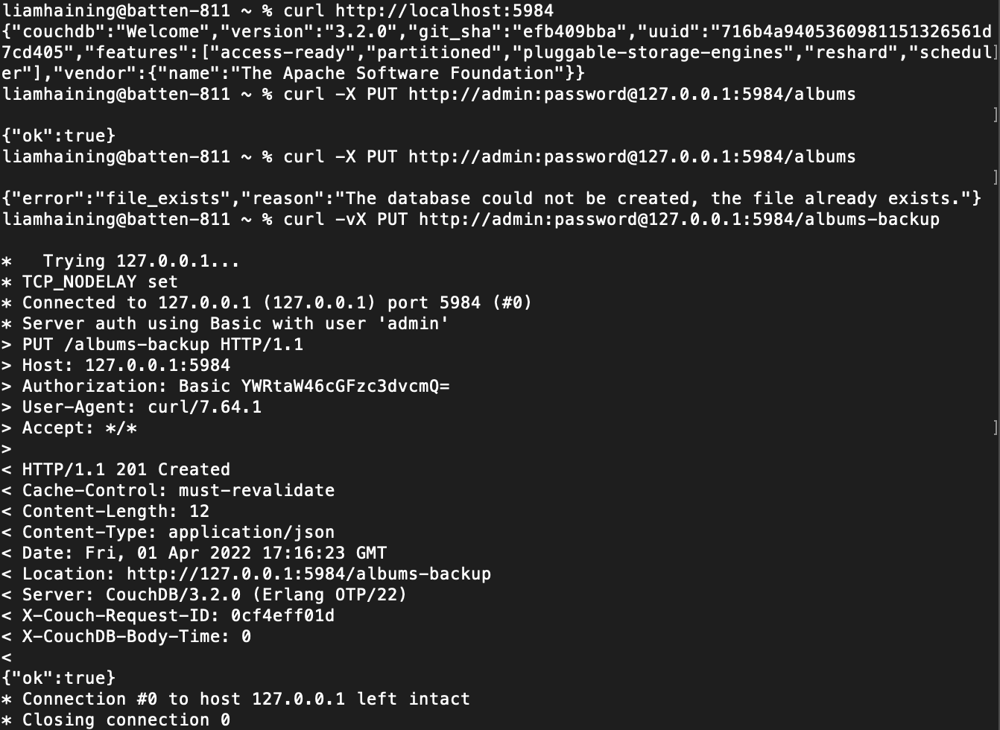

Creating Documents:

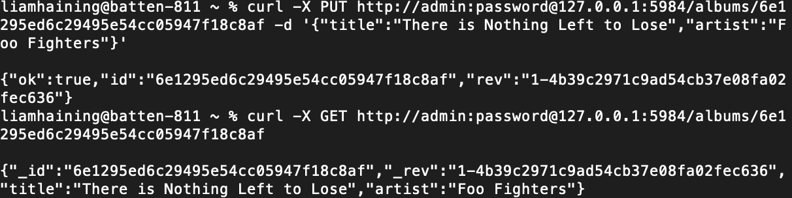

Creating new document revisions:

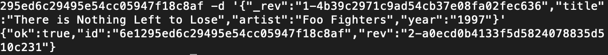

Adding Attachments:
Ran into an syntax issue that my terminal refused to resolve, after working with TA's, opted to add it manually in the UI to continue with the lab.

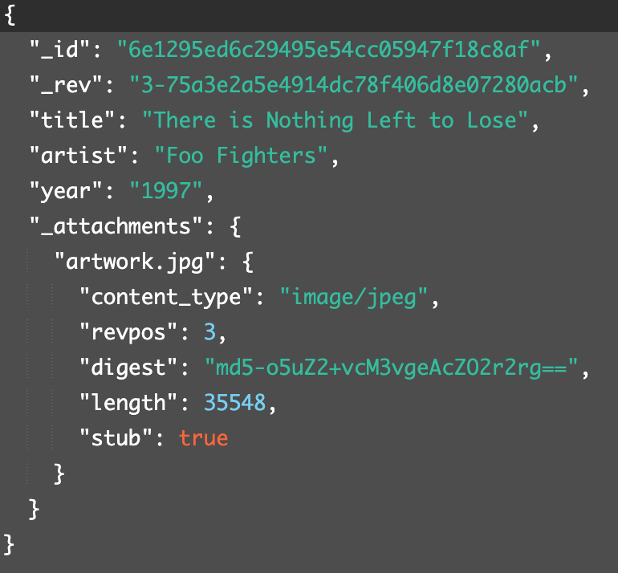

Replicating tables:

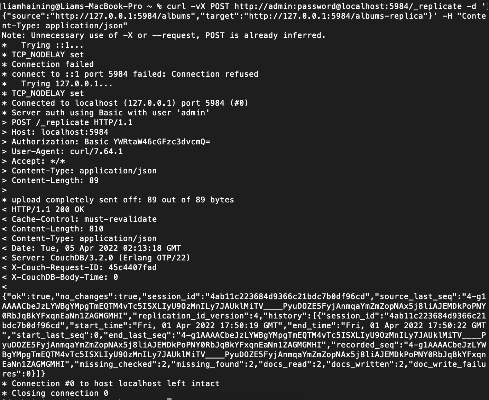

## Checkpoint 4

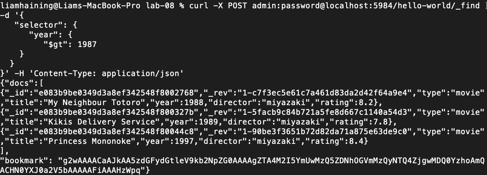

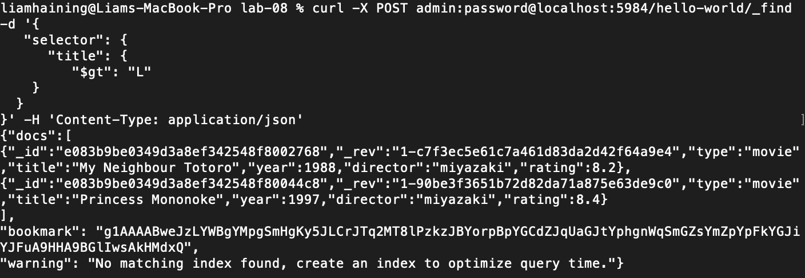

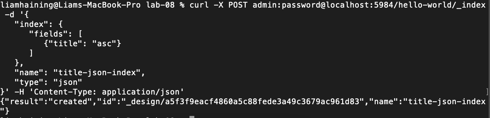

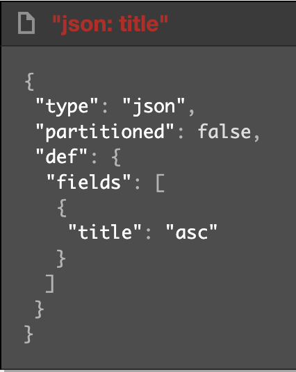

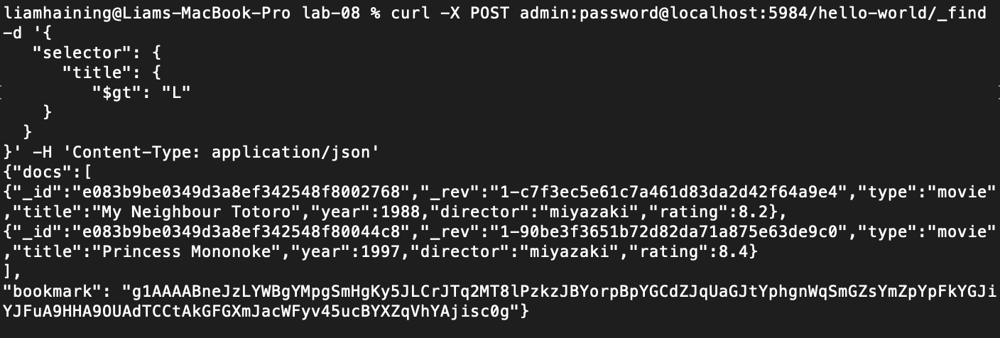
