# Lab 11 - TensorFlow

## Checkpoint 1

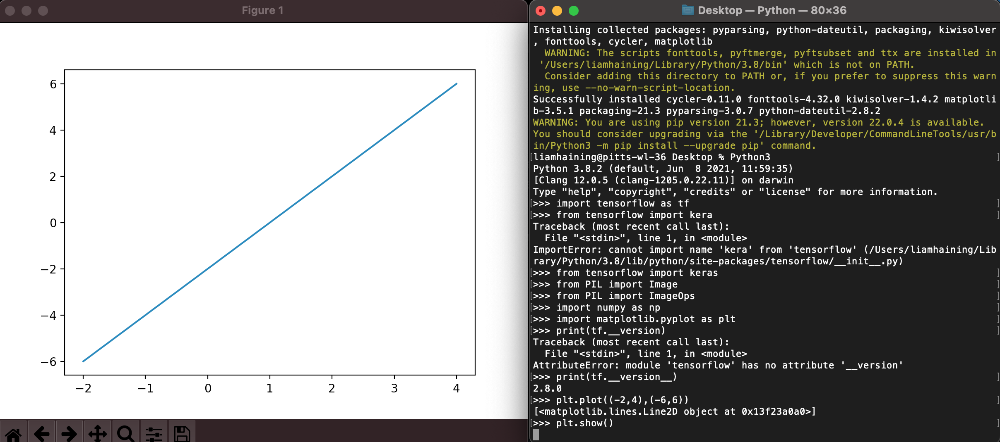

## Checkpoint 2

- All code used for checkpoints 2 and 3 is in fashion.py

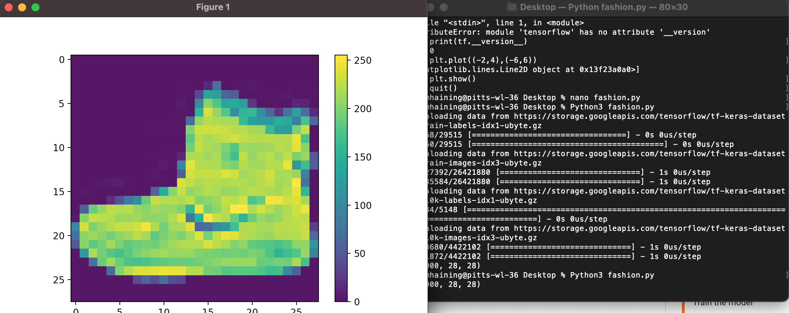

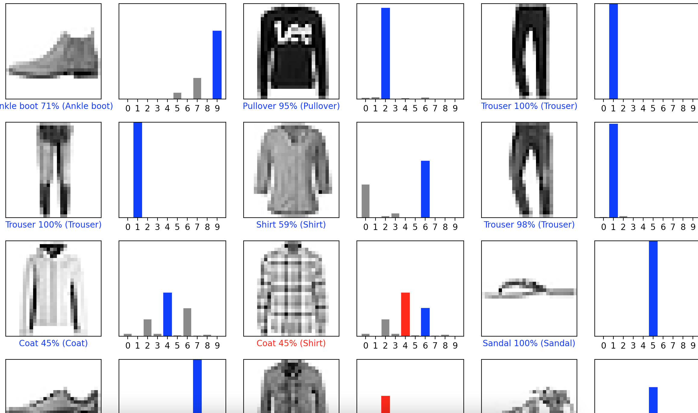

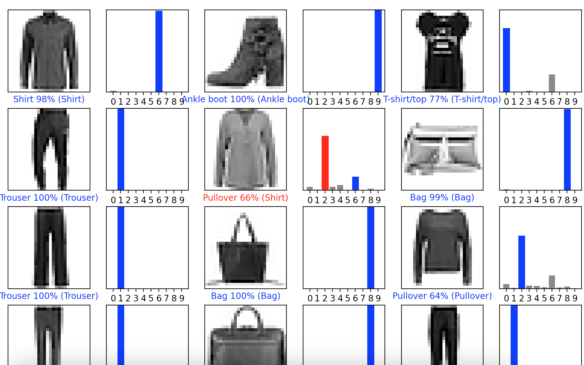

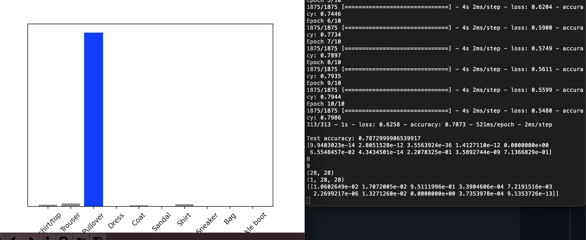

## Checkpoint 3

- Original images

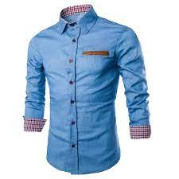

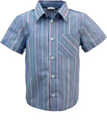

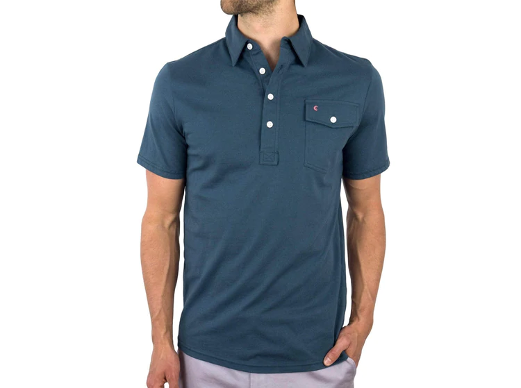

- 28x28 grayscale images

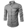

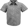

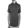

- Results

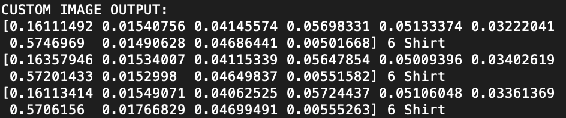
